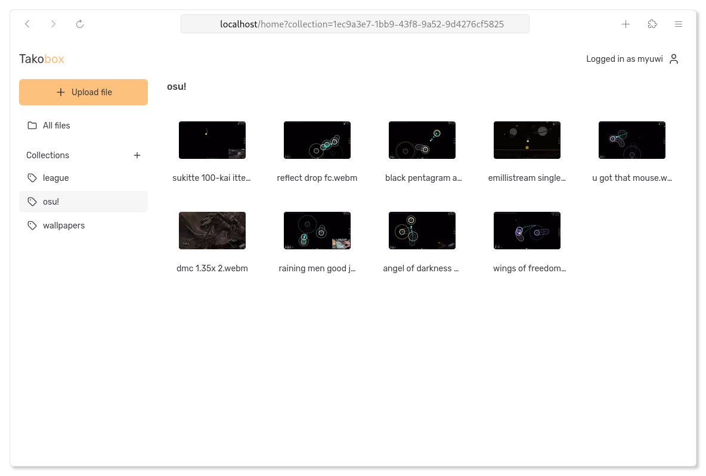

# Takobox

> [!WARNING]
> Still in an experimental state. Use at your own risk!

## Built with

- Rust - Backend Language
- Bun - JavaScript Runtime
- React - Frontend Framework
- TanStack - Core Libraries
- Tailwind CSS - CSS Framework

## Configuration

Takobox can be configured using the following environment variables.

### Backend

| Variable                          | Description                                                            | Default              |
| --------------------------------- | ---------------------------------------------------------------------- | -------------------- |
| `TAKOBOX_DATABASE_URL`            | URL of the Postgres database.                                          | unset                |
| `TAKOBOX_SESSION_SECRET`          | A secret key used sign session tokens. Must be at least 64 bytes long. | unset                |
| `TAKOBOX_ENABLE_ACCOUNT_CREATION` | Whether to allow new user accounts to be created.                      | `false`              |
| `TAKOBOX_MAX_FILE_SIZE`           | Maximum file size in bytes.                                            | `32_000_000` (32 MB) |

### Web

| Variable                       | Description                                            | Default |
| ------------------------------ | ------------------------------------------------------ | ------- |
| `TAKOBOX_INTERNAL_API_URL`     | The internal URL of the backend service. Used for SSR. | unset   |
| `TAKOBOX_DISABLE_LANDING_PAGE` | Can be used to disable the landing page.               | `false` |
